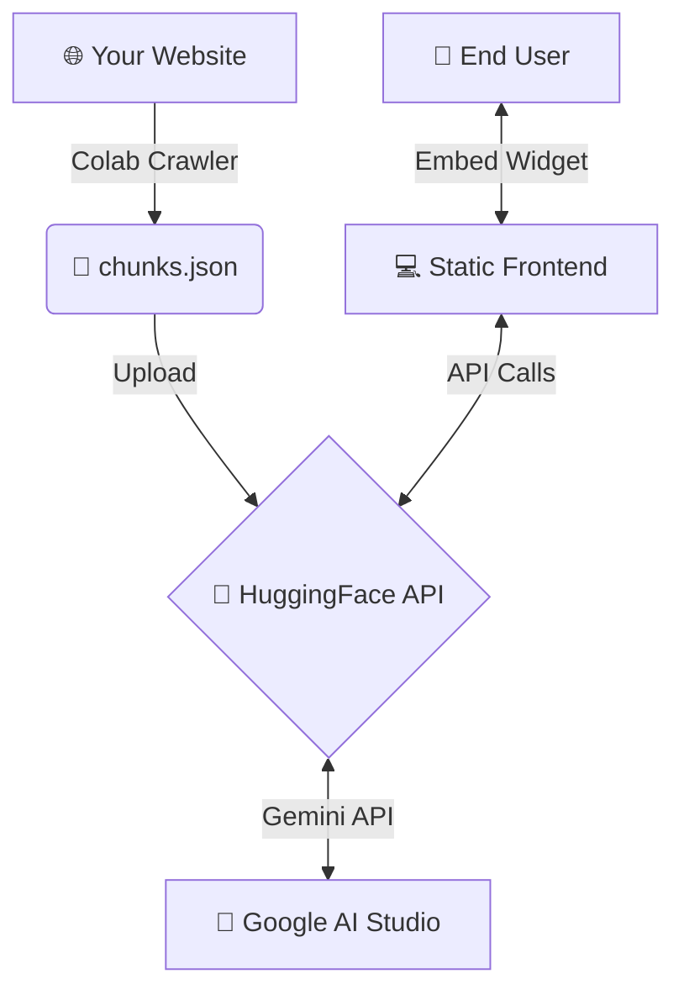

<div align="center">

# 🤖 FMU AI ASSISTANT
**A fully functional, open-source AI assistant platform with a website-only data source.**

[](https://www.python.org/)
[](https://fastapi.tiangolo.com/)
[](https://www.docker.com/)
[](https://huggingface.co/spaces)
[](https://ai.google.dev/)

[Features](#-features) • [Architecture](#-architecture) • [Getting Started](#-getting-started) • [Deployment](#-deployment) • [API Reference](#-api-endpoints)

</div>

---

## ✨ Features

- 🕷️ **Website Web Crawler:** Extract data from any website using the provided Google Colab notebook.
- 🧠 **LLM Powered:** Uses Google's Gemini 1.5 Flash API for fast and intelligent responses.
- ⚡ **High-Performance Backend:** Built with FastAPI, designed for seamless deployment on HuggingFace Spaces.
- 🎨 **Beautiful Dashboard:** Manage your chatbots, settings, and view interactions through a modern web UI.
- 🔌 **Embeddable Widget:** Easily integrate the chatbot into any website with a simple script tag.
- 💸 **100% Free to Host:** Utilize free tiers from Google AI Studio, HuggingFace Spaces, and GitHub Pages.

---

## 🏗️ Architecture

The project is split into three main components:



### 📁 Project Structure

```bash
chatbase-clone/
├── colab/
│   └── crawler.py          # Copy-paste into Google Colab for scraping
├── backend/
│   ├── app.py              # FastAPI backend logic
│   ├── requirements.txt    # Python dependencies
│   ├── Dockerfile          # Configuration for HuggingFace Spaces
│   └── README.md           # HuggingFace Space metadata
└── frontend/
    ├── index.html          # Landing page
    ├── dashboard.html      # Management Dashboard
    ├── create.html         # Create chatbot form
    ├── chat.html           # Standalone chat interface
    ├── embed.html          # Settings & embed code generator
    ├── style.css           # Global design system
    ├── app.js              # Shared utilities
    └── widget.js           # Embeddable chat widget script
```

---

## 🚀 Getting Started

Follow these steps to deploy your own instance of the Chatbase Clone.

### Step 1: Get a Gemini API Key

1. Go to [Google AI Studio](https://aistudio.google.com/app/apikey).
2. Click **"Create API Key"** and copy it.

### Step 2: Crawl Your Website (Google Colab)

1. Open [Google Colab](https://colab.research.google.com/) and create a new notebook.
2. Copy the contents of `colab/crawler.py` into the notebook cells.
3. Update the `CONFIG` block with your website URL:
   ```python
   CONFIG = {
       "start_url": "https://YOUR-WEBSITE.com",
       "max_pages": 100,
       # ... other settings
   }
   ```
4. Run all cells and download the resulting `chunks.json` file.

### Step 3: Deploy Backend to HuggingFace Spaces

1. Navigate to [huggingface.co/new-space](https://huggingface.co/new-space).
2. Set Space name to `chatbase-api`, select **Docker** as the SDK, and click **Create Space**.
3. Upload all files from the `backend/` folder (`app.py`, `requirements.txt`, `Dockerfile`, `README.md`).
4. Go to **Settings** → **Variables and secrets** and add:
   - Name: `GEMINI_API_KEY`
   - Value: Your key from Step 1
5. The space will build automatically. Your API URL will be: `https://YOUR-USERNAME-chatbase-api.hf.space`

### Step 4: Upload Crawled Data

You can upload `chunks.json` using the **Frontend UI** (`create.html`), via **Colab** (uncomment the upload code in `crawler.py`), or using **cURL**:

```bash
curl -X POST https://YOUR-SPACE.hf.space/api/chatbot \
  -H "Content-Type: application/json" \
  -d @chunks.json
```

---

## 💻 Frontend Deployment

Host the static files from the `frontend/` directory on any static hosting provider:

- **GitHub Pages:** Commit to a repo and enable GitHub Pages in settings.
- **Vercel / Netlify:** Drag and drop the `frontend/` folder into their dashboard.
- **Local:** Simply open `frontend/index.html` in your web browser.

Once hosted, open the Dashboard, click **🔑 API Settings**, and enter your HuggingFace Space URL to connect the frontend to your backend.

---

## 🔌 Embed on Your Website

Go to the **Settings & Embed** page on your dashboard to grab your custom embed code. Paste it before the `</body>` tag on your website:

```html
<script>
  window.chatbaseConfig = {
    chatbotId: "my-chatbot",
    apiUrl: "https://YOUR-SPACE.hf.space",
    themeColor: "#6C63FF",
  };
</script>
<script src="https://YOUR-FRONTEND-URL/widget.js" defer></script>
```

---

## 📡 API Endpoints

| Method | Endpoint | Description |
|--------|----------|-------------|
| `GET` | `/api/health` | Health check |
| `POST` | `/api/chatbot` | Create chatbot (send `chunks.json`) |
| `GET` | `/api/chatbots` | List all chatbots |
| `GET` | `/api/chatbot/{id}` | Get chatbot details |
| `PUT` | `/api/chatbot/{id}/settings` | Update chatbot settings |
| `DELETE` | `/api/chatbot/{id}` | Delete a chatbot |
| `POST` | `/api/chat/{id}` | Send a message and stream the response |

### Chat Request Payload

```json
{
  "message": "What is your pricing?",
  "history": [
    {"role": "user", "content": "Hi"},
    {"role": "assistant", "content": "Hello! How can I help?"}
  ],
  "stream": false
}
```

---

## 🛠️ Troubleshooting

| Issue | Solution |
|-------|----------|
| **API: Not Connected** | Verify your HF Space URL in API Settings. |
| **"Gemini API key not configured"** | Add the `GEMINI_API_KEY` secret in HF Space settings. |
| **Crawler stuck / blocked** | Increase `crawl_delay` or reduce `max_pages`. |
| **Widget not showing** | Check browser console for errors; verify `apiUrl` is correct. |
| **HF Space won't build** | Ensure `Dockerfile` and `requirements.txt` are uploaded. |

---

<div align="center">
  <p>Built with ❤️ by the open-source community. <br> Leverage free tiers to host your own AI Chatbot today!</p>
</div>
